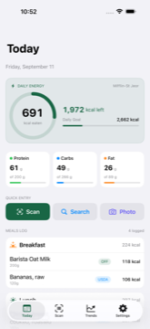
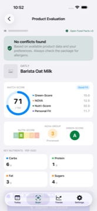
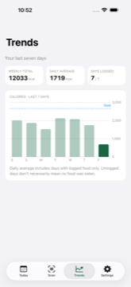
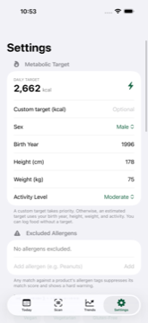

# Solace

AI-native food scanner and diary for iOS. Free, open-source, no paid tier — no servers, either.

**[solace.nandan.fyi](https://solace.nandan.fyi)** · [Privacy Policy](https://solace.nandan.fyi/privacy) · [Support](https://solace.nandan.fyi/support)

<p float="left">
  
  
  
  
</p>

## Features

- **Barcode scanning** — Nutri-Score, NOVA, and Green-Score badges instantly, backed by [Open Food Facts](https://world.openfoodfacts.org).
- **Generic food search** — USDA FoodData Central for anything without a barcode.
- **Photo-based logging** — optional, bring-your-own-key cloud AI estimates a meal from a photo; always an editable draft, never auto-saved.
- **Safety first** — every scan is checked against your allergens and diet exclusions before any score is shown.
- **On-device AI explanations** — Apple Foundation Models explain *why* a food scored the way it did, entirely on-device.
- **Apple Health sync** — opt-in, write-only, one-way.
- **Your data, your iCloud** — everything syncs via CloudKit under your own account. Solace has no servers of its own.

## Requirements

- Xcode 26+
- iOS 26+ (Simulator or device)

## Building

```sh
open Solace.xcodeproj
```

Or from the command line:

```sh
xcodebuild build -project Solace.xcodeproj -scheme Solace -destination "generic/platform=iOS Simulator"
```

Swift Package dependencies resolve automatically on first build. See [`CLAUDE.md`](CLAUDE.md) for test commands and architecture notes.

## Architecture

See [`ARCHITECTURE.md`](ARCHITECTURE.md) for the full data-flow, AI-tier, and scoring-engine writeup.

## Tech stack

SwiftUI · [SQLiteData](https://github.com/pointfreeco/sqlite-data) · CloudKit · HealthKit · VisionKit · Foundation Models

## License

[AGPL-3.0](LICENSE)
